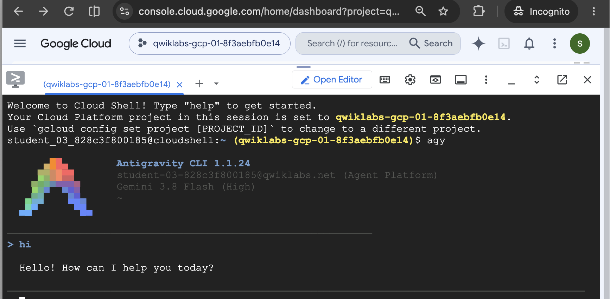
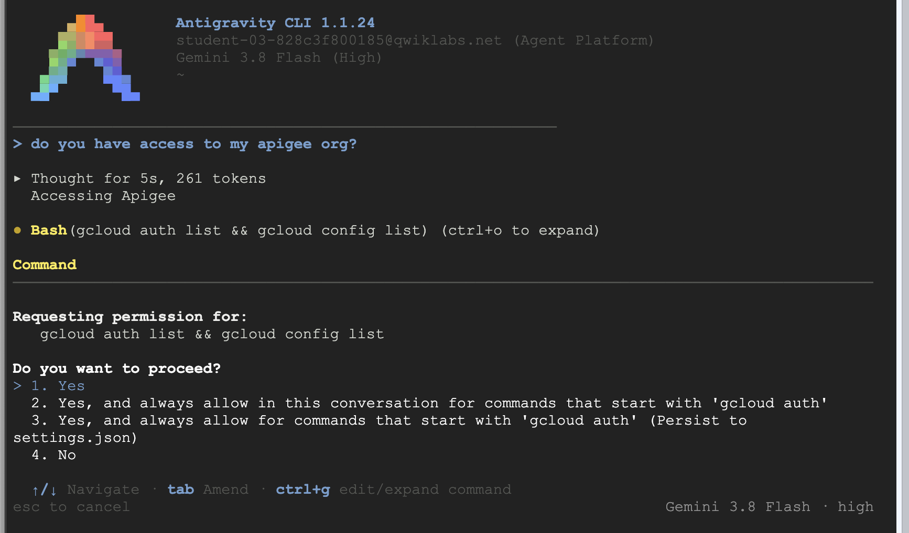

# Part 1: Set Up
1. Navigate to the Shell icon or enter this from a new tab https://shell.cloud.google.com/

2. Run 
   
   `git clone https://github.com/welylau/apijam-ai-ext.git`

3. Run 

    `cd apijam-ai-ext`

    `chmod +x install.sh`

    `./install.sh`

4. Run 
`agy`

    When asked the login method, choose "2. Use Google Cloud project", then "1. Continue with Google Cloud. Copy and paste the authorization link into another browser tab (the same session as your current login). Proceed with login and then copy the Authorization Code, back to the Cloud Shell Terminal.

1. If it prompts "No licenses found. Please enter project ID manually.", copy the GCP Project ID and paste it there and press enter.
2. When asked about "Select Google Cloud Location:", choose "global".
3. Regarding the license, choose "1. Agent Platform - Pay as you go provisioned for your Google Cloud project" and press Enter.
4. For the terminal scheme, choose any of your preferred scheme, then [Next], and Enter.
5. When asked "Do you trust the contents of this project?", choose "Yes, I trust this folder" and Enter.
6.  You could try with a "hi" prompt. If all goes well, you shoud be able to see this.

# Part 2:

1. Prompt to agy "do you have access to my apigee org?", it should take a few second and asking permission. Observe question , if you agree choose either "1 or 2 or 3",  

Pro-tip: only for non-sensitive sandbox environment: If you are "annoyed" with too many "request permission", 
1. Prompt to agy "Help me to deploy the an api proxy from the oauth directory to my apigee org, eval env"
2. Create me