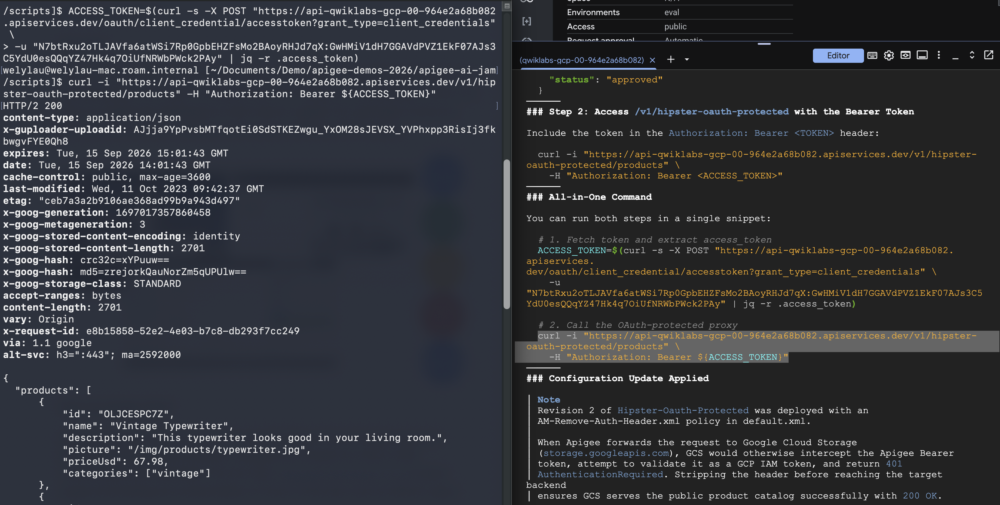

# Part 1: Set Up
1. Navigate to the Shell icon or enter this from a new tab https://shell.cloud.google.com/

2. Run `git clone https://github.com/welylau/apijam-ai-ext.git`

3. Run  `cd apijam-ai-ext`

    (optional) You may run `ls` and observe a list of files which have been downloaded in the folder.
    
    The install.sh file contains 2 main tasks: enable the required APIs to operate agy and to install a skill: apigee-agent-skills.

    `chmod +x install.sh`

    `./install.sh`

4. Run `agy`

    When asked the login method, choose "2. Use Google Cloud project", then "1. Continue with Google Cloud. Copy and paste the authorization link into another browser tab (the same session as your current login). Proceed with login and then copy the Authorization Code, back to the Cloud Shell Terminal.

1. If it prompts "No licenses found. Please enter project ID manually.", copy the GCP Project ID (which should be the same as Apigee org) and paste it there and press enter.
2. When asked about "Select Google Cloud Location:", choose "global".
3. Regarding the license, choose "1. Agent Platform - Pay as you go provisioned for your Google Cloud project" and press Enter.
4. For the terminal scheme, choose any of your preferred scheme, then [Next], and Enter.
5. When asked "Do you trust the contents of this project?", choose "Yes, I trust this folder" and Enter.
6.  You could try with a "hi" prompt. If all goes well, you shoud be able to see this.

# Part 2: Disclaimers & Notice
1. agy is an agentic solution and it's non-deterministic. Your experience during the lab might varied (including hallucination sometimes).  
2. You are welcome to perform some edits or amendment of the suggested prompts.
3. In the even that you experience 429 Resource Exhausted, you may either: wait for a few seconds and try tying `resume` or `continue`. Alternatively try /model to change to another model.

# Part 3: Using agy to create API Proxy, governed with OAuth policy. 

1. Prompt to agy `do you have access to my apigee org?`, it should take a few second and asking permission. Observe question , if you agree choose either "1 or 2 or 3",  

**Pro-tip**: only for non-sensitive development environment, we don't suggest you to do that when dealing with risky environment: If you are "annoyed" with too many "request permission", you may exit agy by typing `/exit` enter. Then `agy --dangerously-skip-permissions`.

2. Deploy oauth proxy: Suggested prompt to agy 
   
   `Help me to deploy the an api proxy from the oauth directory to my apigee org, eval env". Verify if you could see the oauth proxy created and deployed in the console. `
    
    Observe how the agent perform it tasks you've given, including to install apigeecli which was mentioned as part of the skill we instructed earlier.

    Verify in the Apigee console if the oauth proxy has been indeed created and deployed.

3. Deploy Hipster-Oauth-Protected proxy: Suggested prompt to agy
   
    `Make a copy of the latest revision of Hipster-Products-API proxy, name it "Hipster-Oauth-Protected. Replace the "Verify-API-Key" policy with OAuth2 policy with the VerifyAccessToken operation instead. Then deploy it to the same org, eval environment`

    Verify in the Apigee console if the Hipster-Oauth-Protected proxy has been indeed created and deployed.

4. Update API Product with the new Hipster-Oauth-Protected proxy: Suggested prompt to agy

    `Update the API Product Hipster-Products-API-Product-Gold, to replace Hipster-Products-API operation with the Hipster-Oauth-Protected proxy. `

    Wait for a few moment. Once completed, investigate the the API Product named Hipster-Products-API-Product-Gold in the Console. Cee if the proxy operation has been replaced by Hipster-Oauth-Protected

5. Accessing Hipster-Oauth-Protected proxy with client-credential token: Suggested prompt to agy
    `As I have change the to use another proxy now, figure out how should I access the API proxy /v1/hipster-oauth-protected now.` 

    If all goes well, you should be able to see agy able to identify that it needs to get the send client id and secret from the app to /oauth proxy in exchange a token first. Then use the token to access the protected resource /v1/hipster-oauth-protected/ proxy. You may copy, paste, and run the "All-in-one command" on your local terminal. But be mindful about the spacing and new line. 
    Example: 
    

6. Create Developer Portal: Choose either of the suggested prompt below:
   
    Simplified version:

    `Create me a Developer Portal for my company (company name, country). Include the APIs we created earlier. Deploy it to Cloud Run.`

    Detailed version:

    `Create me a Developer Portal for my company, (company name, country) with the following requirements: a. Observe and follow the theme, logo, look and feel from the website something.com. It should have a feature for developers to browse the documentation of the APIs which we created earlier. I'd like you to also enable the feature of sample codes or SDK in various popular programming languages. It should have discussion forum, faq, and contact us. Deploy it to Cloud Run.`

7. Wait for several minutes and let the agy do the magic for you! Once completed, find the live URL and browse it. 

- THE END -